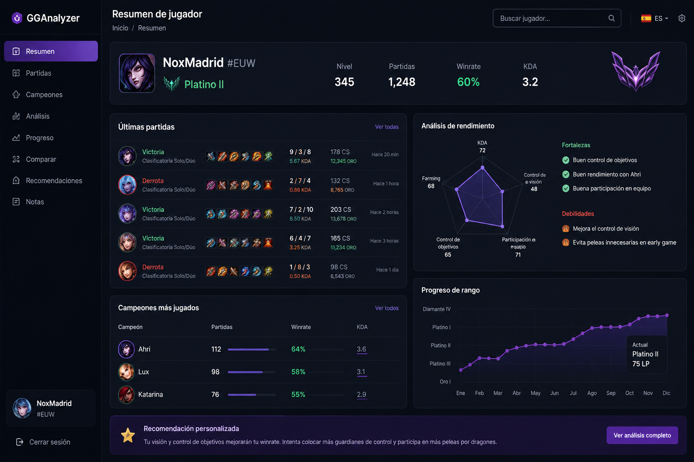

# GGAnalyzer 🇪🇸

<p align="center">
  
  
  
  
</p>

<p align="center">
  
  
  
</p>

---

# 🎮 Analizador de partidas de League of Legends

GGAnalyzer es una herramienta **open-source** para analizar partidas de League of Legends, descubrir errores de gameplay y ayudar a los jugadores a mejorar su rendimiento.

El proyecto está enfocado en la comunidad española y europea (**EUW**), ofreciendo estadísticas, análisis personalizados y recomendaciones fáciles de entender.


---

## ✨ Características

🚧 **Actualmente en desarrollo**

* ✅ Perfil del jugador
* ✅ Historial de partidas
* ⏳ Análisis automático de partidas
* ⏳ Estadísticas por campeón
* ⏳ Análisis de KDA
* ⏳ Control de visión
* ⏳ Progreso de rango
* ⏳ Recomendaciones personalizadas
* ⏳ Bot para Discord
* ⏳ Soporte completo en español

---

# 📊 Ejemplo de análisis

```text
Jugador:
NoxMadrid#EUW

Rango:
Platino II

Últimas partidas:
10

Winrate:
60%

KDA:
3.2

Análisis:

✅ Buen control de objetivos

✅ Buen rendimiento con Ahri

⚠️ Mejora el control de visión

⚠️ Evita peleas innecesarias en early game
```

---

# 🎯 Objetivo del proyecto

GGAnalyzer busca responder preguntas como:

* ¿Por qué estoy perdiendo partidas?
* ¿Qué errores repito?
* ¿Qué campeones funcionan mejor conmigo?
* ¿Qué debo mejorar para subir de rango?

---

# 🛠️ Tecnologías

## Frontend

* React
* TypeScript
* Tailwind CSS
* Recharts

## Backend

* Node.js
* Express
* REST API

## Base de datos

* PostgreSQL

## APIs externas

* Riot Games API

---

# 📂 Estructura del proyecto

```bash
gganalyzer/

├── client/                 # Aplicación React
│
├── server/                 # API Backend
│
├── docs/                   # Documentación e imágenes
│
├── docker-compose.yml
├── README.md
└── LICENSE
```

---

# 🚀 Instalación


## Backend

```bash
cd server

npm install

npm run dev
```

---

## Frontend

```bash
cd client

npm install

npm run dev
```

---

# 🔐 Variables de entorno

Crear un archivo `.env`:

```env
RIOT_API_KEY=tu_api_key
DATABASE_URL=tu_database_url
PORT=3000
```

---

# 🗺️ Roadmap

## Fase 1 — Base del proyecto

* [x] Configuración inicial
* [x] Estructura del repositorio
* [x] Conexión con Riot API
* [x] Sistema de usuarios

## Fase 2 — Análisis

* [x] Procesamiento de partidas
* [x] Estadísticas avanzadas
* [x] Sistema de puntuación
* [x] Recomendaciones inteligentes

## Fase 3 — Comunidad

* [ ] Perfiles públicos
* [ ] Bot de Discord
* [ ] Compartir análisis

## Fase 4 — IA

* [x] Revisión automática de partidas
* [ ] Coach personalizado
* [ ] Planes de mejora

---

# 🤝 Contribuir

Las contribuciones son bienvenidas.

Proceso:

1. Haz un fork del proyecto

2. Crea una rama:

```bash
git checkout -b feature/nueva-funcion
```

3. Realiza tus cambios:

```bash
git commit -m "Añadir nueva función"
```

4. Envía un Pull Request

---

# 📜 Licencia

Este proyecto está bajo licencia MIT.

---

# ⚠️ Aviso legal

GGAnalyzer es un proyecto independiente creado por la comunidad.

League of Legends y Riot Games son marcas registradas de Riot Games, Inc.

Este proyecto no está afiliado ni patrocinado por Riot Games.

---

# ⭐ Apoya el proyecto

Si GGAnalyzer te ayuda a mejorar tu gameplay:

* Dale una estrella ⭐
* Comparte el proyecto
* Contribuye con nuevas ideas

```
```
